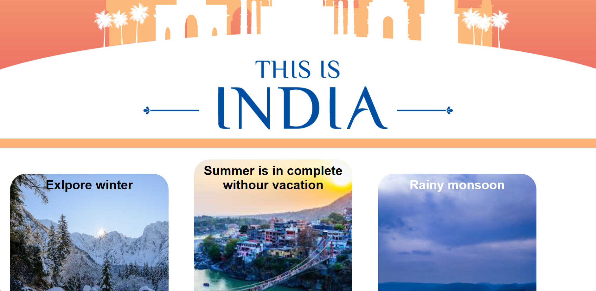

# IBM-Project-Great-India-Tour
Indian Tour Website | IBM Project | HTML, CSS, JavaScript
# Great-India-Tour
"Your perfect Indian adventure starts here. Great India Tour offers expertly curated itineraries across the subcontinent. Explore, experience, and fall in love with India."


# Great-India-Tour

**Project Link**: **  
**Description**:"Your perfect Indian adventure starts here. Great India Tour offers expertly curated itineraries across the subcontinent. Explore, experience, and fall in love with India." 

---

## 📸 Project Screenshot


---

## 🚀 Features
- Trust & Support Features 
- Core Tour/Booking Features  
- India-Specific Destination & Content Features 

---

## 🛠️ Technology Used
- HTML  
- CSS  
- JavaScript  

---

## 📂 Installation
1. Clone the repository:  
```bash
git clone https://github.com/Puneetkumar0709/Great-India-Tour.git


```
2. Navigate to the project folder:
```bash
cd Great-India-Tour

```
3. Open index.html in your browser to view the website.
---
🤝 Contributing
Contributions are welcome!

- Fork the repository
- Create a new branch 
- Make your changes and commit (git commit -m 'Add feature')
- Push to the branch (git push origin main)
- Open a Pull Request

📄 License
This project is licensed under the MIT License. See the LICENSE file for details.

## Thanks for visiting this repo!
